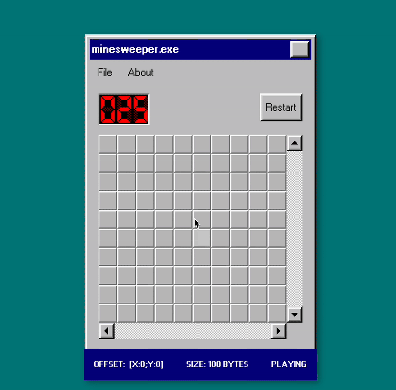

# minesweeper

[](https://app.netlify.com/projects/minesweeper1/deploys)

Minesweeper game with a 10000x10000 field (10⁸ tiles). Play online: https://minesweeper1.netlify.app/



## About the project

It's a pet project and an experimental playground to try modern (and, for me, new) web technologies and algorithms.

## Roadmap

- [x] Game engine (PubSub pattern)
- [x] UI layer (React, React95)
- [x] Storage map in a binary data (`ArrayBuffer`, `UInt8Array`)
- [x] Generate map inside the Web Workers (Web Workers, Transferable objects)
- [x] Scheduler for recursive map opening (Scheduler.postTask, Priotity queue)
- [ ] Leaderboard
- [ ] Write wrapper for Scheduler + polyfill
- [ ] Save and load the game from file (OPFS)
- [ ] Multiplayer mode (WebSockets, WebRTC)
- [ ] Local-first mode (PWA, CRDT)

## Running locally

```bash
pnpm i
pnpm dev
```

## Troubleshooting

- `requestIdleCallback` and `scheduler` are not supported in Safari, so we use polyfills for these APIs
- Custom scrollbars (`::-webkit-scrollbar-*` CSS pseudo-elements) are not supported in — surprise! — Safari
