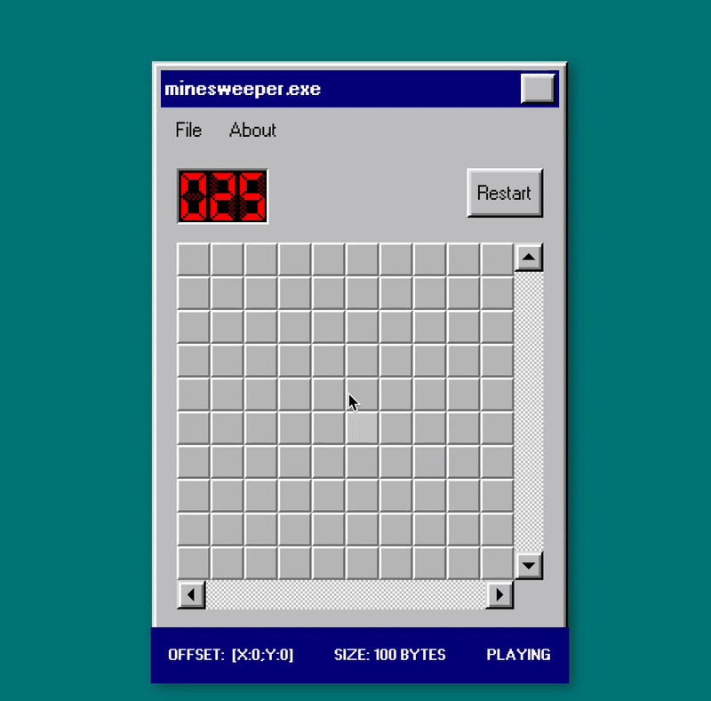

# minesweeper

[](https://app.netlify.com/projects/minesweeper1/deploys)

Minesweeper game with a 10000x10000 field (10⁸ tiles). Play online: https://minesweeper1.netlify.app/



## About the project

It's a pet project and an experimental playground to try modern web technologies and algorithms.

## Run locally

```bash
# with pnpm
pnpm install
pnpm dev

# or with npm
npm install
npm run dev
```

## Troubleshooting

- `requestIdleCallback` and `scheduler` are not supported in Safari, so we use polyfills for these APIs
- Custom scrollbars (`::-webkit-scrollbar-*` CSS pseudo-elements) are not supported in — surprise! — Safari
